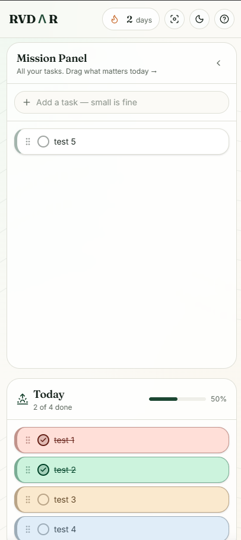
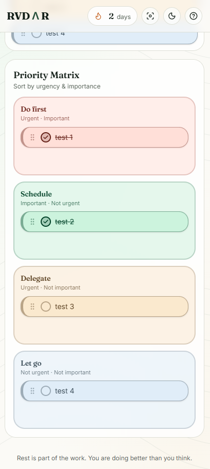
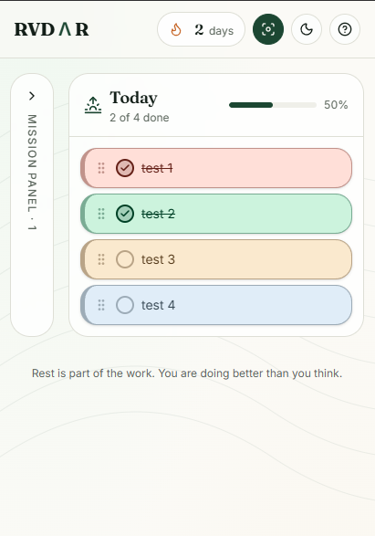
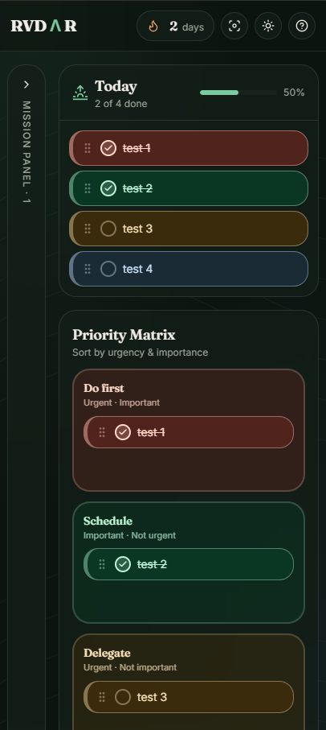
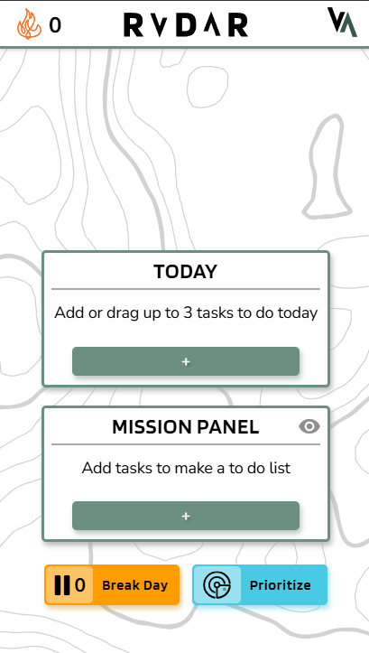
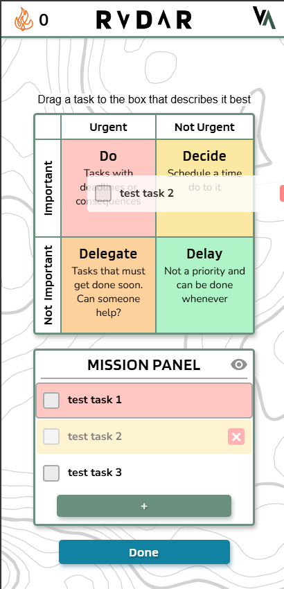
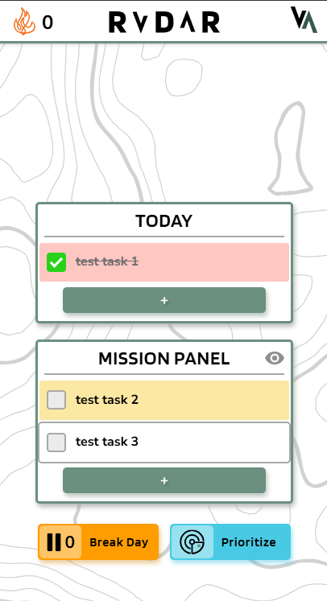

# RVDΛR

### A calm, focused task tool for overwhelmed minds.

RVDΛR helps you simplify a never-ending to-do list by surfacing just one to three tasks to do **today**, with the Eisenhower Matrix to help you prioritize when you can't decide where to start.

---

## About

Do you get so overwhelmed by your to-do list that you freeze and can't start anything — even though you *want* to? That's **executive dysfunction**, and it's common in neurodivergent people, especially those with ADHD.

Instead of trying to do everything at once, RVDΛR asks one question: *what are the one to three things you want to do today?* Each completed day earns a **streak**, and every five streak days earns a **break day** — a guilt-free pause that won't break your streak.

It's not about *maximizing* productivity. It's about taking small steps and not beating yourself up about it.

---

## RVDΛR 2.0 (Redesign)

A modernized, mobile-first revamp of RVDΛR — preserving the original concept while improving clarity, accessibility, and the streak system.

### Mission Panel & Today
| Mission Panel + Today | Priority Matrix | Collapsed Sidebar | Dark Mode |
| :---: | :---: | :---: | :---: |
|  |  |  |  |

### What's new
- **Reorderable tasks** in Today and the Priority Matrix (drag from anywhere on the card)
- **Stronger color coding** for at-a-glance prioritization
- **Mission Panel** collapses to a sidebar to keep focus on Today
- **Dark mode** for low-energy hours
- **Rewritten streak logic** with proper edge-case handling
- **Improved empty states**, focus mode, and help dialog

---

## Original RVDΛR (v1)

The original Vue + Sass version, built around the Eisenhower Matrix and streak/break-day concept.

| Home | Priority Matrix | Today in Progress |
| :---: | :---: | :---: |
|  |  |  |

---

## Usage

1. Add your tasks to the **Mission Panel**.
2. Drag one to three of those tasks into **Today**.
3. Need help deciding? Tap **Prioritize** to open the Eisenhower Matrix and drop each task into *Do*, *Schedule*, *Delegate*, or *Let go*.
4. Check tasks off as you complete them.
5. Complete your Today list to earn a **streak day**. Every 5 streak days earns 1 **break day** (max 5 banked).

---

## Tech Stack

**RVDΛR 2.0**
- React 19 + TanStack Start (Vite 7)
- Tailwind CSS v4
- shadcn/ui + Radix primitives
- dnd-kit for drag-and-drop
- Deployed on Vercel

**RVDΛR v1**
- Vue.js
- Sass
- Jest
- Deployed on Netlify

---

## License

Licensed under the MIT License.

---

## Contact

**Brianna Woodruff** — briannaewoodruff@gmail.com

